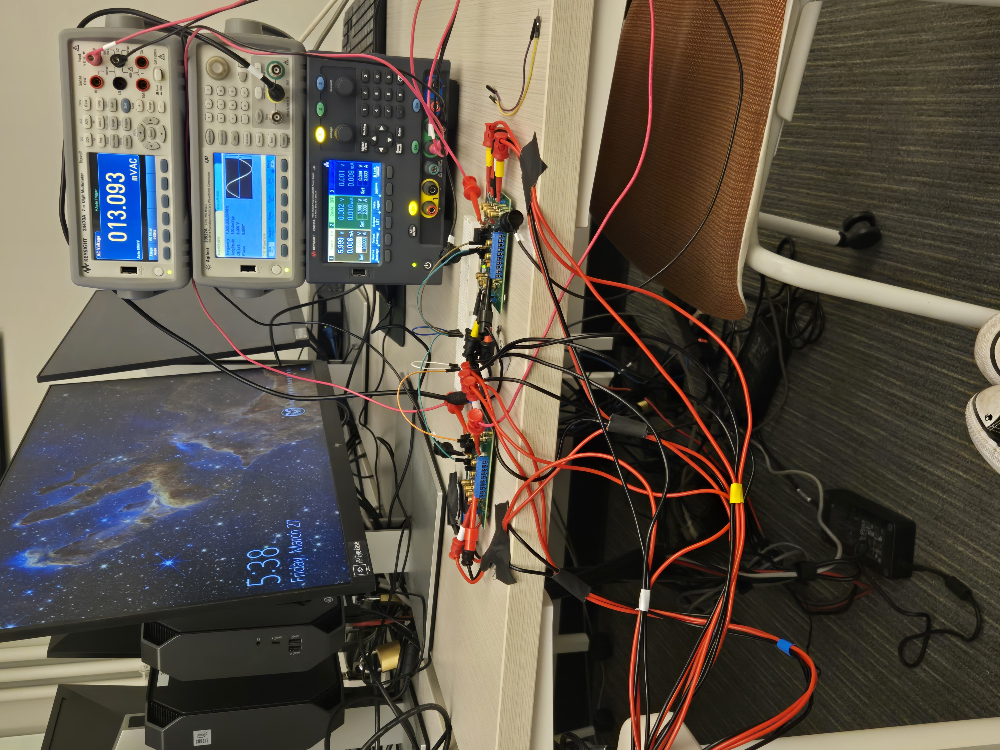
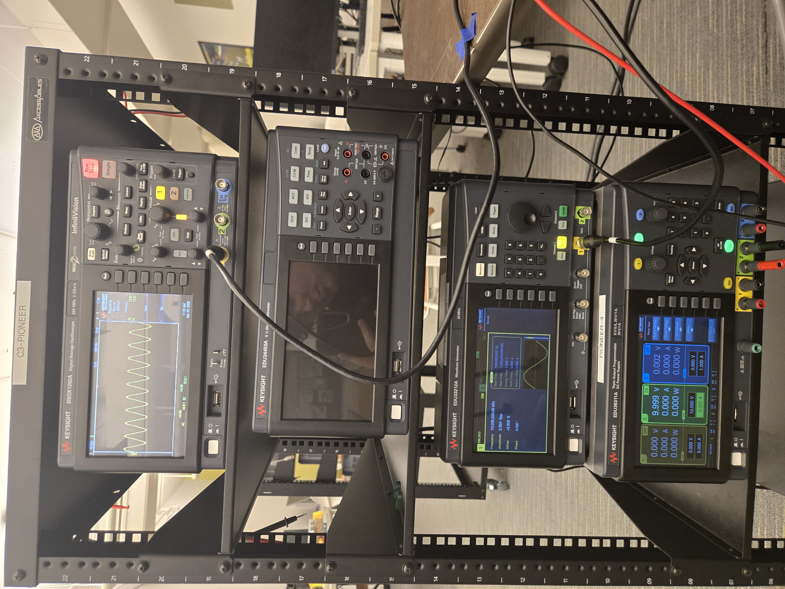

<!-- Use this command to make the report: -->

<!-- nix-shell --pure -p pandoc -p texlive.combined.scheme-small --run "pandoc -H img_fix.tex
-f markdown+table_captions EIT_Final_Report.md -o EIT_Final_Report.pdf" -->

Electrical Impedance Tomography (EIT) is a method of medical imaging which
visualizes the internal resistivity of the human body, most commonly for
real-time monitoring of the lungs. It measures voltage on n-1 pairs of
electrodes, and sends an alternating current through the remaining pair of
electrodes. The pair of electrodes which produces the alternating current is
then replaced with a different pair of electrodes until all possible
combinations of electrodes are exhausted. This results in a non-linear,
ill-posed boundary value problem which, when solved, gives a 2D tomogram of
resistivities. We created a 4 electrode EIT device which utilizes machine
learning algorithms running locally to predict the location of an object of
higher resistivity (OHR) within one of 16 sectors. This probability distribution
is then visualized on a computer monitor in real time.

Link to code and other documentation: <https://github.com/ihsotas0/simple-eit>

{ width=85% }

\newpage

# Final Device

## Hardware

Team members responsible: Jonah, Connor, Christian

The final design consisted of a 14cm diameter 3.5cm tall open cylinder of PETG
which served to contain the water (100ml). Four stainless steel electrodes (2.5
x 2.5cm) were clamped to the corners of each quadrant using alligator clips. The
test rig presented at the industry advisory board meeting included slots for the
electrodes. The top of each alligator clip is soldered to four wires which have
pomona grabbers on the opposite end. The 16 pomona grabbers (4 for each
quadrant) are secured to the MUX36D04EVM-PDKs (MUXs), labeled as M1 and M2 shown
in the circuit diagram. The positive probes of the EDU33212A Keysight Waveform
Generator and DSOX1202A Keysight Oscilloscope are connected to DA and DB of M1
respectively, while the negative probes are connected to DA and DB of M2. VSS of
each MUX is shorted to GND using a wire. A second wire bridges the VDD and GND
of each MUX. VDD of M1 is then connected to a 10V DC power supply and GND is
connected to the ground of the DC power supply. The GPIO pins of the Raspberry
Pi 3B are connected as shown in the circuit diagram. They operate on a 3.3V
logic to enable and disable each MUX, and switch which outputs (SA/B 1-4) to the
inputs (DA/DB). Pin 39 also grounds the Raspberry Pi 3B to the GND of the MUXs.
The Raspberry Pi 3B is connected to the EDU33212A Keysight Waveform Generator
and DSOX1202A Keysight Oscilloscope via USB. It is also wired to a keyboard and
mouse over USB, and the monitor over HDMI. For testing, PLA cylinders of 3.0,
6.0, 8.0, 12.5, and 15.0mm radius were used.

TODO: Need to mention wavegen parameters including frequency

{ width=85% }

| Component           | Model/Specification                      | Purpose                              | Source               |
| :------------------ | :--------------------------------------- | :----------------------------------- | :------------------- |
| Digital Multimeter  | Keysight (any VISA-compatible)           | RMS voltage measurement              | C105                 |
| Waveform Generator  | Agilent/Keysight (any VISA-compatible)   | Excitation signal                    | C105                 |
| Analog Multiplexers | 2× MUX36D04EVM-PDK                       | Electrode selection (S+, S-, V+, V-) | Borrowed, EIR Mentor |
| DC Power Supply     | 10 V DC                                  | Power multiplexer evaluation boards  | C105                 |
| Controller          | Raspberry Pi 3B (recommended)            | GPIO control and computation         | Borrowed, Friend     |
| 3D Printed Test Rig | PET G                                    | Hold OHR and water                   | I2P Lab, Free        |
| Electrodes          | 4x Stainless steel electrodes            | Measure voltage/generate current     | Given, Free          |
| Connectors          | (16 + 2 + 2 + 4)x Banana hook connectors | Wire devices together                | Purchased, Amazon    |

Table: Hardware requirements

## Software

Team members responsible: Jonah

TODO

# Experiment 4

Summary: Verified device on large OHR to differentiate four quadrants.

Date: March 27, 2026

Team members present: Jonah, Connor, Christian

Our first experiment since the mid-report, we started by using new four channel pomona grabber to alligator clip cables for the MUX in order to switch between configurations. First we used the MUX manually to find trends in the data. We observed that the index of the 2nd highest of the non-diagonal voltage measurements defined the location of the object. Using this newfound method, we decided to test our code using an eraser as our OHR and conducted a second manual MUX test. Through this testing we found that the RPi MUX switching wad backwards from Experiment 3 which reversed our data classification and caused the issues in our experiment 3 data. This experiment was the first full integration of RPi, MUX, and visualizer for our project using the four sectors with eraser and voltmeter, not scope, and 2nd highest method.

# Experiment 5

Summary: Switched the device from a slow voltmeter to a faster oscilloscope.

Date: April 3, 2026

Team members present: Jonah, Connor

Original version of data collect with manual labeling (painfully) with voltmeter
and tried 4 pixel display running 2nd highest, which didn't work. It did work
for voltmeter, but the voltmeter voltage measurements were more seperatble than
the scope. First test of using scope vs wavegen to improve speed. Spend hours
trying to speed up voltmeter and failed, so which used scope, rewrote code, etc.

# Experiment 6

Summary: Collected 22000 16-sector location data points and 2,000 instrument
data points for the CURC poster and verification of ML models.

Date: April 12, 2026

Team members present: Jonah

For both CURC and our real-time demonstration of the device, I wanted to collect
significant data on different objects.

Used EDU scope, got data using data_collector.py

# Designed CURC Poster

Summary: Created research poster on data collected for the device on different OHRs.

Date: April 13-14, 2026

Team members present: Jonah (Connor: Circuit diagram)

I decided to present an evaluation of our device at CURC, the undergraduate
poster conference. I wanted to see the smallest object our device could detect
and evaluate different ML models at different radii of the OHR.

After collecting the data for the five different objects (see Experiment 6), I
used an early version of `classifier.py` to generated the ML models and evaluate
their accuracies for each of the OHRs:

Then, using `visualization.py`, I started making figures for the poster,
which proved to be quite challenging given the large amount of data that needed
to be presented:

Here are the final figures we used for CURC:

# Experiment 7

Summary: Final debugging and verification of device for 16-sector visualization
and ML model caching.

Date: April 19, 2026

Team members present: Jonah, Christian

Verified device, fixed device_manager bugs (serial input and reloading connection twice).

# Presented CURC Poster

Summary: Presented resarch at CURC.

Date: April 21, 2026

Team members present: Jonah, Connor, Christian

# Conclusion

# Other Images

# Acknowledgments

Chuck Duey, Dr. Elaine Linde, Dr. Jennifer Mueller, Dr. Diego Krapf, Prof.
Olivera Notaros, Alaa Jallad, Nicholas Green, and Jennifer Kreinbrink.

# Original Tables

| Bill of Materials                                         |                      |
| --------------------------------------------------------- | :------------------- |
| Keysight digital multimeter (34470A)                      | C105                 |
| Agilent waveform generator (33600A)                       | C105                 |
| (16 + 2 + 2 + 4) x Banana-to-hook/hook-to-plug test leads | C105                 |
| 2 x MUX36D04EVM-PDK                                       | Borrowed, EIR Mentor |
| 4 x stainless steel electrodes                            | Given for Free       |
| Raspberry Pi 3B                                           | Borrowed, Friend     |
| 3D printed test rig, OHR, and other plastic apparatus     | I2P Lab, Free        |
| Water                                                     | Free                 |

| Deadlines             |                                                                                                                                  |
| --------------------- | :------------------------------------------------------------------------------------------------------------------------------- |
| Week 2                | Advanced proof of concept, test rig, device requirements.                                                                        |
| Week 3-4              | Hard-/software requirements, order DEMUXs, pseudo-code manual algorithm, AC power supply, digital multimeter.                    |
| Week 5                | Manual MUX, manual algorithm (PyVISA).                                                                                           |
| Week 6 (Mid-report)   | Implement microcontroller, microcontroller program, computer real-time visualization algorithm.                                  |
| Week 7 (Spring Break) | Break\! No catch up needed\!                                                                                                     |
| Week 8                | Fix algorithm to correctly identify location, speed up voltage measurements (from \>1 s to <5 ms), improve wiring and apparatus. |
| Week 9                | Complete system integration, debugging (device complete).                                                                        |
| Week 10               | Improve speed of microcontroller, DEMUX, visualizer.                                                                             |
| Week 11               | Finalize demo presentation and project report.                                                                                   |
| Week 12 (Demo)        | Catch-up week.                                                                                                                   |

| Goals   |                                                                                                                                                                                                 |
| ------- | :---------------------------------------------------------------------------------------------------------------------------------------------------------------------------------------------- |
| Must    | Test rig, 4 electrode network, independent AC power supply, digital voltmeter, DEMUX to switch configurations (30 Hz), Python visualizer (4 pixel display), microcontroller system integration. |
| Want    | Higher speed configuration switching (\~360 Hz), faster Python/C visualizer, custom AC power supply, full lumped element model solver.                                                          |
| Great   | More electrodes (5), bigger test rig, full BVP solver.                                                                                                                                          |
| Miracle | Even more electrodes, more DEMUXs, organic tests (arteries, veins, trachea). Full EIT with lung test (impossible).                                                                              |

