<!-- Use this command to make the report: -->
<!-- pandoc -H img_fix.tex -f markdown+table_captions midreport.md -o EIT_Mid_Report.pdf -->

Electrical impedance tomography is a method for medical imaging which visualizes
the internal resistivity of the human body, namely for real-time monitoring of
the lungs. It measures the voltage on n-electrodes and sends an alternating
current through 2 other electrodes. This results in a non-linear, ill-posed
boundary value problem which, when solved, gives a 2D tomogram of resistivities.
We have decided to make a 4 electrode electrical impedance tomography device for
our project using an *empirical algorithm* to calculate the location of an
object. Our visualization will, at the very least, show four pixels, each
representing the four quadrants outlined on the sides by the electrodes. Each
pixel will show the likelihood that there is an object of higher resistivity
(OHR) contained in that quadrant. This visualization, we hope, will update at a
reasonable framerate of 5-60 fps. If we succeed at this, we may expand our
project to have more electrodes, a better framerate, a complete inverse
algorithm, or improve it in other ways.

Link to code and other documentation: <https://github.com/ihsotas0/simple-eit>

\newpage

# Experiment 1

For our initial experiment, we wanted to see if we could measure a difference in
voltage between nodes in an aqueous solution at all. We used our Analog
Discovery kits to do this:

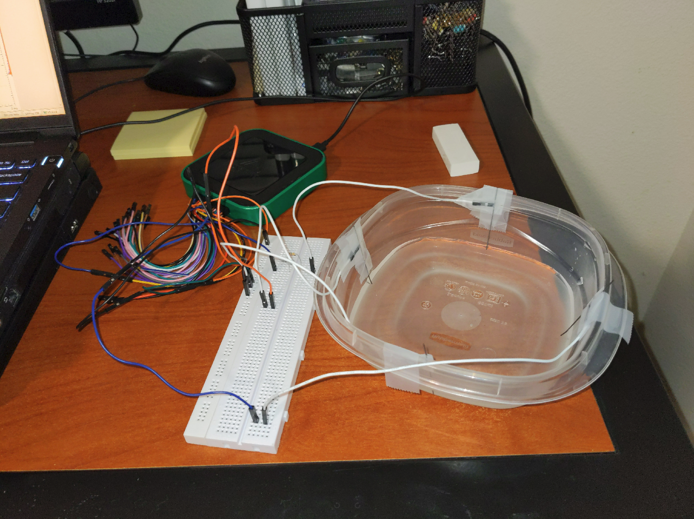{width=50%}

Two of our team members reproduced this experiment independently. We found that
when an object (eraser) is placed in the medium, the voltage at each of the
nodes being measured changes, giving a difference in voltage between the two
nodes. Using the results of this experiment as a basic proof-of-concept, we
moved on to an advanced proof-of-concept experiment, developing the test rig,
implementing PyVISA, finding two MUXs, and getting a microcontroller.

# Experiment 2

Our next experiment was to simulate all 6 MUX configurations and gather voltage
data to verify our conditional algorithm. To do this, we connected a Keysight
voltmeter between two electrodes and an Agilent wavegen between the other two.
We set the AC signal to a 2.5 V magnitude, 0 V offset, and 1 kHz frequency.

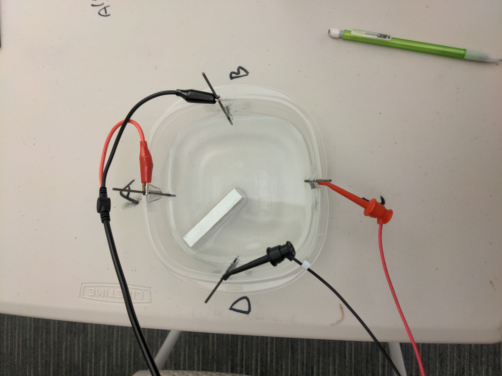{width=50%}

Our measured voltages are in the following table:

| $V_{AB}$ (mV) | $V_{AC}$ (mV) | $V_{AD}$ (mV) | $V_{BC}$ (mV) | $V_{BD}$ (mV) | $V_{CD}$ (mV) | OHR (Real) | OHR (Algor.) |
|:--------------|:--------------|:--------------|:--------------|:--------------|:--------------|:-----------|:-------------|
| 1093          | 566           | 439           | 406           | 650           | 962           | AB         | AB           |
| 423           | 572           | 862           | 983           | 357           | 472           | BC         | BC           |
| 753           | 488           | 389           | 412           | 614           | 1108          | CD         | CD           |
| 450           | 615           | 1104          | 842           | 551           | 669           | AD         | AD           |

Table: Experiment 2 Voltages

Our basic conditional algorithm (empirical algorithm that fit the data), for
identifying the location of the object of high resistivity (OHR), with locations
being labeled by adjacent nodes:

```
if V_AC < V_BD:
    if V_AB > V_CD: OHR = "AB"
    if V_AB < V_CD: OHR = "CD"
if VAC > VBD:
    if V_AD > V_BC: OHR = "AD"
    if V_AD < V_BC: OHR = "BC"
```

All of this work is in the following image:

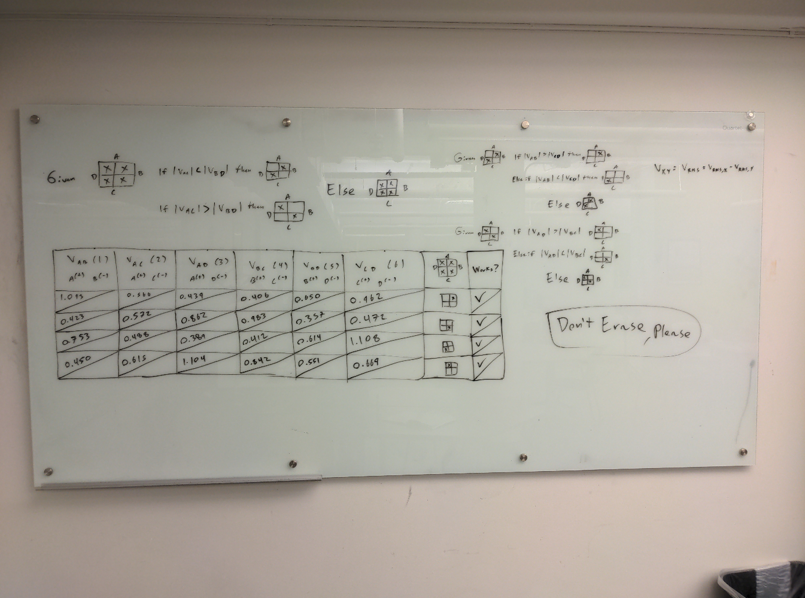{width=50%}

# Device Management and MUX Code in Python

Before beginning experiment 3, we started by writing some PyVISA code to
interface with the voltmeter and wavegen using a Raspberry Pi 3B. We also
configured Linux to allow for USB connection to the voltmeter and wavegen. Then,
we wrote some code so the Raspberry Pi could control the MUX boards using GPIO
pins and visualize the location of the object.

External Python libraries: PyVISA, gpiozero, Matplotlib, NumPy.

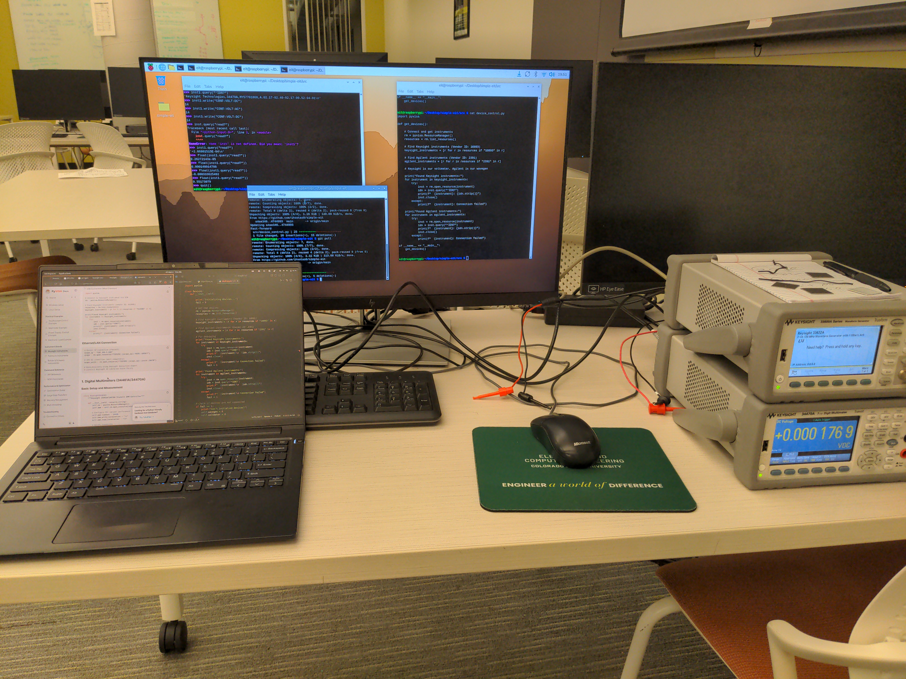{width=50%}

# Experiment 3

Our most recent experiment involved a full demonstration of the device. We used
our second test rig prototype and an eraser as the OHR (as we have used
previously).

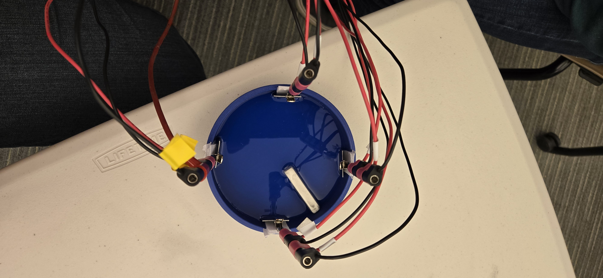{width=50%}

It was previously found how to wire the nodes to the MUX boards to ensure each
configuration could be easily switched between. To start with, we made a table
of where the positive and negative terminals of the wavegen and voltmeter
connected to the nodes of the device for each of the 6 configurations:

| Configuration | $S^+$ | $S^-$ | $V^+$ | $V^-$ |
|---------------|-------|-------|-------|-------|
| 1             | A     | B     | C     | D     |
| 2             | A     | C     | B     | D     |
| 3             | A     | D     | B     | C     |
| 4             | B     | C     | A     | D     |
| 5             | B     | D     | A     | C     |
| 6             | C     | D     | A     | B     |

Table: Wavegen and Voltmeter Nodes for Each Configuration

Then, we made a table showing which board nodes (i.e. S1A, S1B) connected to
which device nodes (i.e. A, B, C, D) for each MUX board. The MUX36D04EVM-PDK
boards we were given by our EIR mentor gave us just enough room to get each
configuration. The MUX36D04 contains two MUXs, each set to the same selection
for any input. Each MUX36D04EVM-PDK contains one MUX36D04. This constricted how
we wired the device, where the voltmeter/wavegen terminals were connected to the
input of the MUX, and the 4 outputs were connected to any of the four nodes of
the device:

| Board Selection | $S^+$ (MUX 1) | $V^+$ (MUX 2) |
|---------------------------|---------------|---------------|
| S1                        | A             | B             |
| S2                        | B             | A             |
| S3                        | C             | A             |
| S4                        | A             | C             |

Table: Board 1 Routing Table

| Board Selection | $S^-$ (MUX 1) | $V^-$ (MUX 2) |
|---------------------------|---------------|---------------|
| S1                        | C             | D             |
| S2                        | D             | B             |
| S3                        | D             | C             |
| S4                        | B             | D             |

Table: Board 2 Routing Table

The selection is controlled by two inputs, A0 and A1:

| Board Selection | A0 | A1 |
|-----------------|----|----|
| S1              | 0  | 0  |
| S2              | 0  | 1  |
| S3              | 1  | 0  |
| S4              | 1  | 1  |

Table: Board Control Input

Using these tables, we can get all 6 configurations. The inputs (A0, A1) for
each board to get each configuration:

| Configuration | Board 1 Input | Board 2 Input |
|---------------|---------------|---------------|
| 1             | 11            | 11            |
| 2             | 00            | 00            |
| 3             | 00            | 10            |
| 4             | 01            | 00            |
| 5             | 01            | 10            |
| 6             | 10            | 01            |

Table: Configuration Switching Table

All of this work is in the following image:

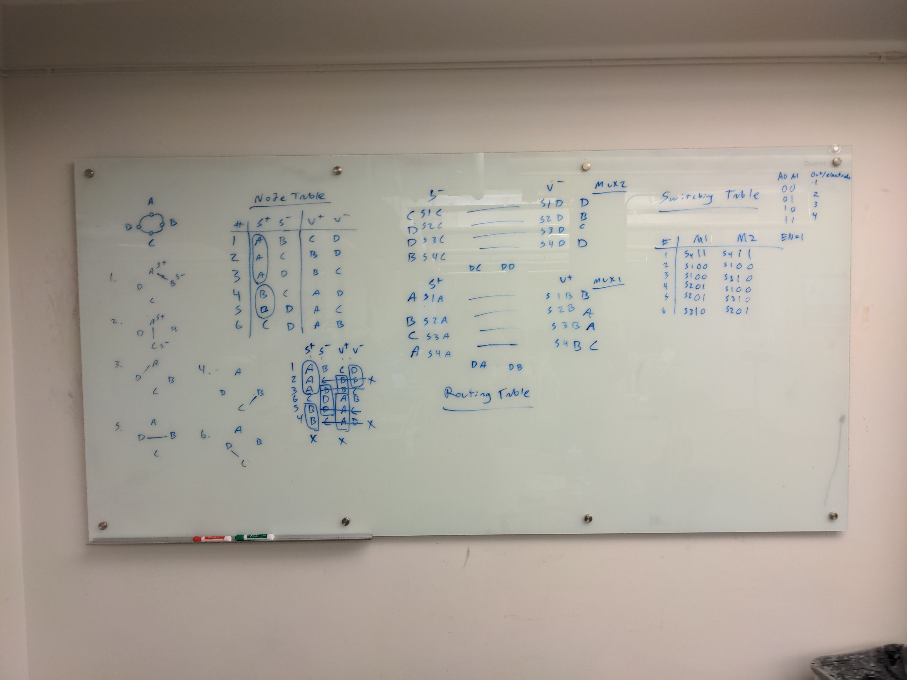{width=50%}

The two evaluation boards (MUX boards) were connected to the four nodes on the
test rig by 16 leads, which were then connected to the voltmeter and wavegen.
The Raspberry Pi GPIO pins originally connected directly to the MUX boards for
switching. 

{width=50%}

A separate DC power supply was connected to the boards to provide 15 V.

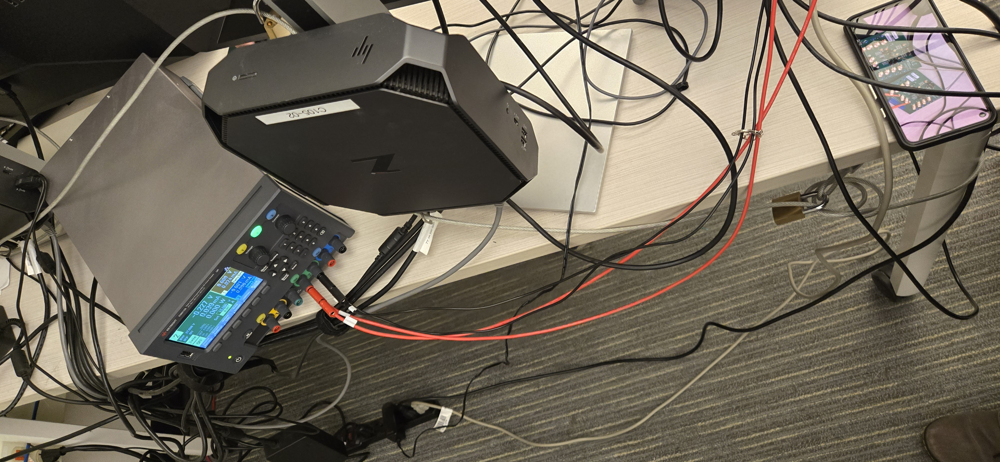{width=50%}

## Ground Issue

We quickly realized that both MUX boards were not switching configurations by
looking at the voltmeter output collected by the Raspberry Pi, which never
changed. So, we set up an experiment to see if the GPIO pins created a high
enough voltage to be registered as a 1 by the boards (2.0 V) with repect to the
aforementioned DC supply.

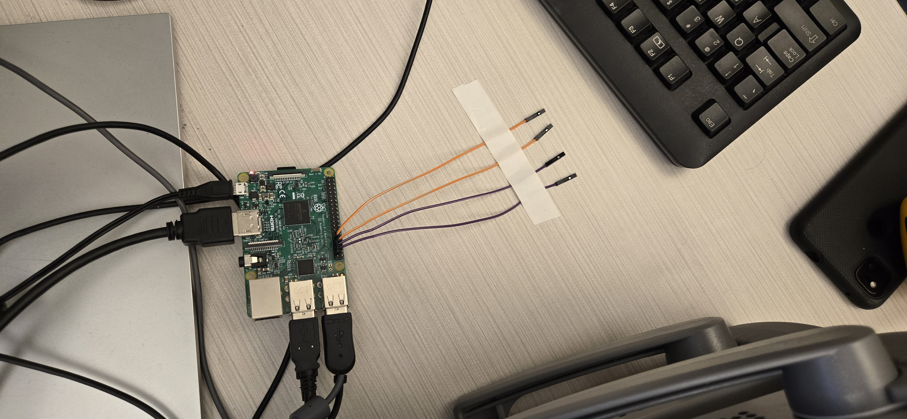{width=50%}

Running the experiment for each configuration to additionally test if A0 and A1
where being set correctly for each configuration, in the order 2, 3, 5, 4, 6, 0
(this order was optimal to reduce MUX switches needed), we found that the
voltage did not pass the high logic voltage threshold, and that A0 and A1 were
swapped.

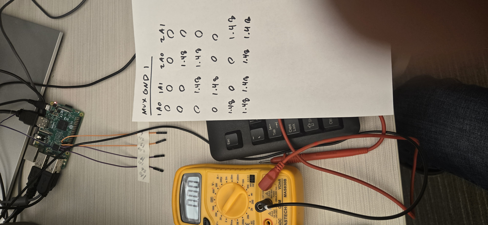{width=50%}

By connecting the Raspberry Pi's ground with the MUX boards, we fixed this
issue.

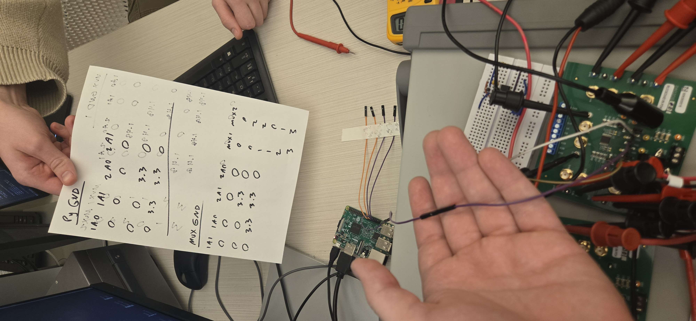{width=50%}

A0 and A1 were swapped because they were wired backwards on the boards. The code
was labelled correctly for which GPIO pin lead to A0 and A1 for each board.
Unfortunately, we didn't realize this until it was too late.

## Blasting 15 V into Raspberry Pi

Before we started troubleshooting the GPIO pins, we decided to manually MUX the
board using its own ground and power supply to verify other parts of our device:

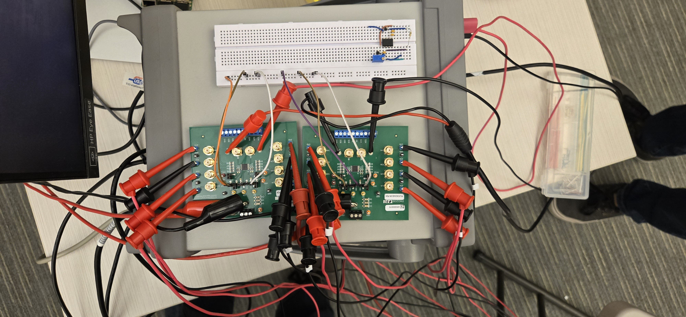{width=50%}

Once we discoverd the actual issue with pins A0 and A1, and the ground issue, we
decided to plug the Raspberry Pi back in. The board's power supply was 15 V, and
its lead was next to the leads for A0 and A1 for both boards. Inevitably, a
teammate plugged the 15 V lead into the Raspberry Pi, killing it instantly. The
live wire is shown in the image below (it is the only lead connected to the
breadboard):

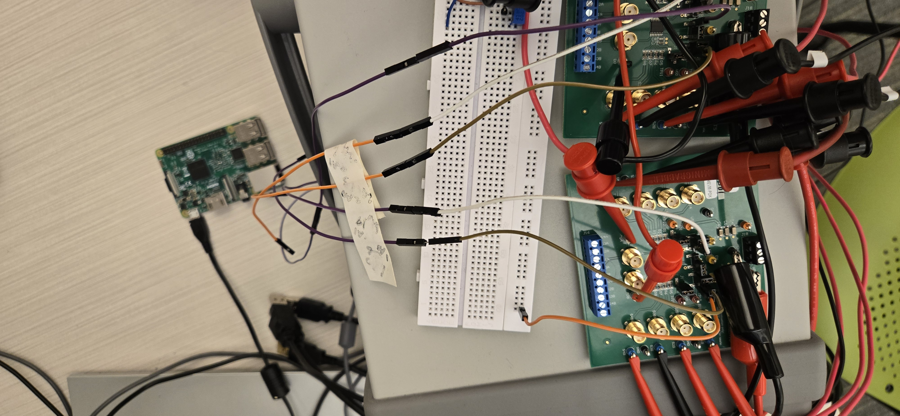{width=50%}

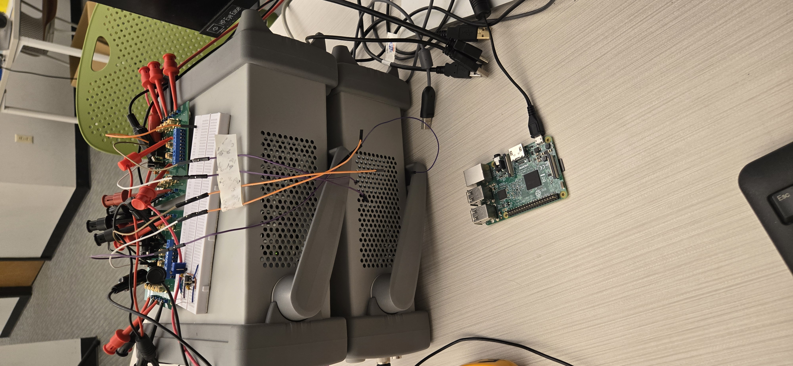{width=50%}

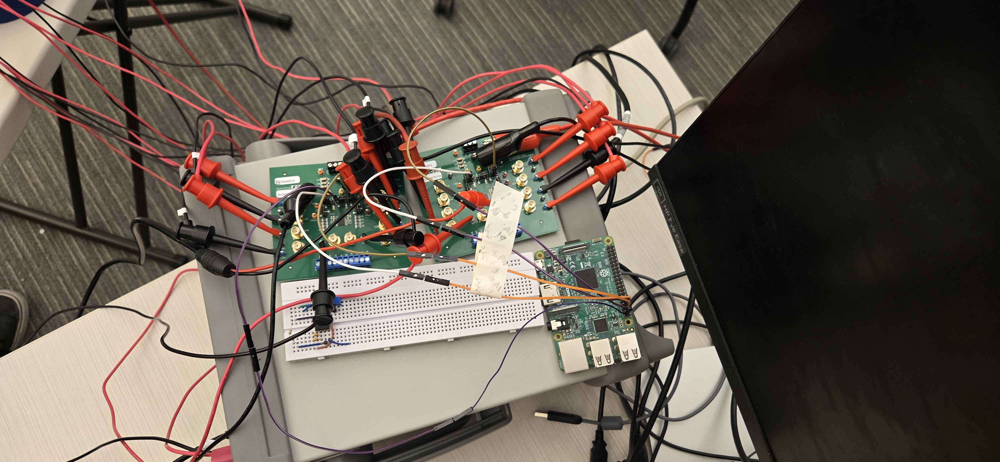{width=50%}

This was only a minor set back, however, as another classmate had a spare
Raspberry Pi for us to use.

## New Raspberry Pi

With the new Raspberry Pi, we rewired everything:

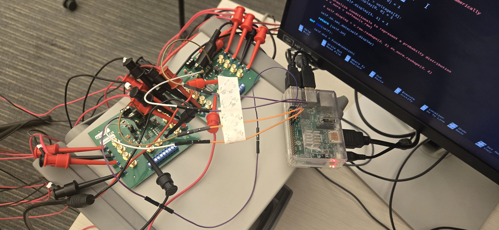{width=50%}

Despite this, our device still does not function. Most recently, we have been
working on debugging why the measured voltages don't match our algorithms
predictions, and we have been working on speeding up the voltage measurements,
which currently take around 1 second per configuration.

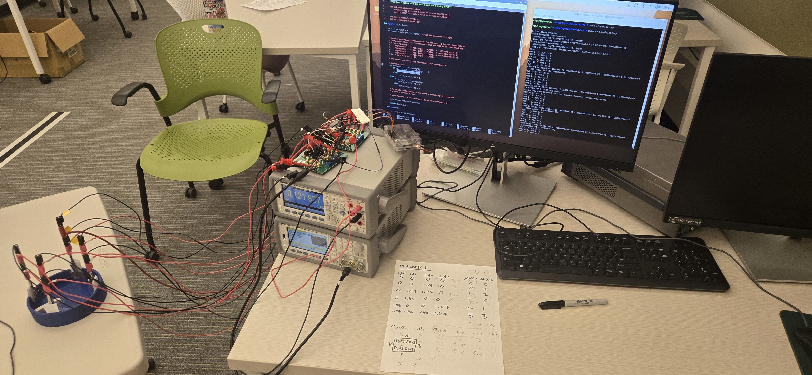{width=50%}

The issue we are currently having is that the voltage measurements don't predict
the location accurately using our conditional algorithm:

| Real OHR Location | Predicted OHR Location |
|-------------------|-------------------------|
| AD                | AD                      |
| BC                | CD, AD, AB              |
| CD                | AB                      |
| AB                | AB                      |

Table: Experiment 3 Results

After spring break, we plan to fix this issue and improve the device's voltage
measurement speed (the primary bottleneck).

# Conclusion

In the 5 weeks since submitting our project proposal, we managed to achieve all
of our goals as set in the deadlines table. Despite encountering hardware
setbacks (including a grounding issue that required connecting the Raspberry Pi
ground to the MUX boards and an accidental 15 V surge that destroyed the first
Raspberry Pi) we successfully rebuilt the system and have a fully functional
test rig, multiplexer control, and PyVISA-based measurement automation. The
conditional algorithm correctly identifies the object’s location for two of the
four quadrants (AD and AB) but still misclassifies BC and CD. After spring
break, we will focus on debugging the algorithm, reducing the measurement time
(currently ~1 s), and integrating a real‑time four‑pixel visualizati on. These
improvements will bring us closer to a complete working demo by the end of the
semester.

# Other Tables

| Bill of Materials                                             |                  |
|---------------------------------------------------------------|:-----------------|
| Keysight digital multimeter (34470A)                          | C105             |
| Agilent waveform generator (33600A)                           | C105             |
| (16 + 2 + 2 + 4) x Banana-to-hook/hook-to-plug test leads | C105             |
| 2 x MUX36D04EVM-PDK                                           | Borrowed, EIR Mentor  |
| 4 x stainless steel electrodes                                | Given for Free   |
| Raspberry Pi 3B                                               | Borrowed, Friend |
| 3D printed test rig, OHR, and other plastic apparatus         | I2P Lab, Free    |
| Water                                                         | Free             |

| Deadlines             |                                                                                                                                   |
|-----------------------|:----------------------------------------------------------------------------------------------------------------------------------|
| Week 2                | Advanced proof of concept, test rig, device requirements.                                                                         |
| Week 3-4              | Hard-/software requirements, order DEMUXs, pseudo-code manual algorithm, AC power supply, digital multimeter.                     |
| Week 5                | Manual MUX, manual algorithm (PyVISA).                                                                                            |
| Week 6 (Mid-report)   | Implement microcontroller, microcontroller program, computer real-time visualization algorithm.                                   |
| Week 7 (Spring Break) | Break\! No catch up needed\!                                                                                                      |
| Week 8                | Fix algorithm to correctly identify location, speed up voltage measurements (from \>1 s to \<5 ms), improve wiring and apparatus. |
| Week 9                | Complete system integration, debugging (device complete).                                                                         |
| Week 10               | Improve speed of microcontroller, DEMUX, visualizer.                                                                              |
| Week 11               | Finalize demo presentation and project report.                                                                                    |
| Week 12 (Demo)        | Catch-up week.                                                                                                                    |

| Goals         |                                                                                                                                                                                                 |
|---------------|:------------------------------------------------------------------------------------------------------------------------------------------------------------------------------------------------|
| Must          | Test rig, 4 electrode network, independent AC power supply, digital voltmeter, DEMUX to switch configurations (30 Hz), Python visualizer (4 pixel display), microcontroller system integration. |
| Want          | Higher speed configuration switching (\~360 Hz), faster Python/C visualizer, custom AC power supply, full lumped element model solver.                                                          |
| Great | More electrodes (5), bigger test rig, full BVP solver.                                                                                                                                          |
| Miracle       | Even more electrodes, more DEMUXs, organic tests (arteries, veins, trachea). Full EIT with lung test (impossible).                                                                              |


